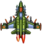
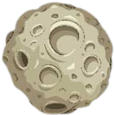
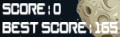

# Fighter
## 1. Giới thiệu game
- Game dựa trên cảm hứng từ các thể loại game bắn súng lấy điểm
- Mã nguồn được viết bằng ngôn ngữ C++ và đồ họa SDL2

Nhiệm vụ: bắn thiên thạch lấy điểm và sống sót lâu nhất có thể

## 2. Các đối tượng trong game:

- Đối tượng điều khiển: Tiêm kích bắn thiên thạch

- Đối tượng mối hiểm nguy: Thiên thạch

- Đạn tiêm kích bắn để phá hủy thiên thạch

- Đồng hồ hiển thị thời gian nạp đạn

- Bổ trợ tốc biến

- Điểm hiện tại và điểm cao nhất

## 3. Cách chơi

- Nhấn nút  để sang trái
- Nhấn nút  để sang phải
- Nhấn nút  để lên trên
- Nhấn nút  để xuống dưới
- Nhắn nút SPACE để bắn đạn
- Nhấn C kèm theo các nút di chuyển để tốc biến theo hướng chỉ định
- Mỗi lần bắn trúng thiên thạch sẽ được tính là 1 điểm, tích được 5 điểm liên tiếp sẽ được một lần tốc biến (tối đa 5 lần)
- Một băng đạn sẽ có 15 viên đạn, sau khi bắn hết cần chờ 3s để nạp lại
- Game kết thúc khi tiêm kích bị thiên thạch va trúng
- Khi kết thúc game ấn Y/N để chơi tiếp hoặc dừng chơi

## 4. Về đồ họa game

Các nguồn tham khảo: 1945 Air Force, Pinteres, Liên quân Moblie.

## 5. Về source game
- CommonFunc: chứa các hàm ban đầu, phổ biến
  + Khởi tạo window, renderer, SDL, SDL_Image, SDL_TFF, SDL_Mixer
  + Báo lỗi
  + Load ảnh
  + Kiểm tra các va chạm

- BaseObject: class nền chứa các biến, hàm làm nền tảng cho các class đối tượng khác
  + Gồm biến SDL_Rect và SDL_Texture
  + Hàm tải đồ họa và hiển thị đối tượng
  + Hàm tạo clip background
  + Hàm khởi tạo vị trí, lấy vị trí của đối tượng

- MainObject: class xử lí các đối tượng chính của game (dựa trên class BaseObject)
  + Di chuyển tiêm kích
  + Khởi tạo và hiển thị tất cả thiên thạch
  + Khởi tạo và hiển thị đạn, đếm thời gian hồi đạn
  + Dịch chuyển tiêm kích khi dùng tốc biến

- ThreatObject: class quản lí từng đối tượng thiên thạch (dựa trên class BaseObject)
  + Di chuyển thiên thạch
  + Xóa thiên thạch khi bị phá hủy hoặc di chuyển khỏi màn hình

- BulletObject: class quản lí từng đối tượng đạn (dựa trên class BaseObject)
  + Di chuyển đạn
  + Xóa đạn khi va chạm hoặc đi ra khỏi màn hình
 
- ExplosionObject: class xử lí các vụ nổ khi va chạm (dựa trên class BaseObject)
  + Load và hiển thị vụ nổ

- Interface: class hiển thị giao diện game
  + Hiển thị điểm hiện tại, điểm cao nhất, lượng đạn còn lại, thời gian nạp đạn, số bổ trợ tốc biến
  + Hiển thị giao diện GameOver

- Main: hàm xử lí game
- Folder Image: chứa đồ họa sử dụng trong game
- Folder Sound: chứa âm thanh trong game
- Folder Font: chứa phông chữ dùng trong game
- File DataFile: chứa dữ liệu điểm cao nhất

Video demo: [https://drive.google.com/file/d/15izXjxzwXue9CHNNfI0ipn3hw3S5YcIZ/view?usp=drive_link](https://drive.google.com/file/d/15izXjxzwXue9CHNNfI0ipn3hw3S5YcIZ/view?usp=drive_link)
